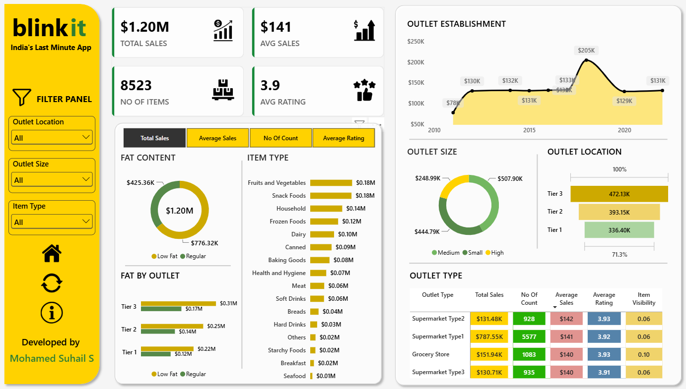

# BlinkIT Grocery Sales Dashboard

## Project Overview

An interactive Power BI dashboard developed to analyze BlinkIT grocery sales performance and generate meaningful business insights.

The dashboard focuses on sales performance, outlet characteristics, product categories, customer ratings, and key business metrics.

## Objectives

- Analyze overall sales performance
- Understand outlet performance
- Analyze product categories
- Identify key business metrics
- Compare sales across different outlet characteristics
- Understand the impact of outlet size, location, and type on sales
- Identify patterns that can support data-driven business decisions

## Tools & Technologies

- Power BI
- Power Query
- DAX
- Microsoft Excel

## Dashboard Preview

## Key KPIs

- **Total Sales:** $1.20M
- **Average Sales:** $141
- **Number of Items:** 8,523
- **Average Rating:** 3.9

## Dashboard Analysis

The dashboard provides analysis across:

- Outlet Establishment
- Outlet Size
- Outlet Location / Tier
- Outlet Type
- Item Type
- Fat Content
- Fat Content by Outlet

## Key Insights

The dashboard helps identify important patterns in grocery sales performance based on:

- Outlet characteristics
- Product categories
- Sales performance
- Customer ratings
- Outlet size and location
- Fat content distribution

These insights can help understand which outlet and product characteristics are associated with sales performance.

## Business Recommendations

- Identify high-performing outlet characteristics for future expansion.
- Focus on product categories contributing significantly to sales.
- Compare outlet performance across different locations and sizes.
- Monitor customer ratings along with sales performance.
- Use sales trends to support business and outlet-level decision making.

## Project Files

- `BlinkIT_Grocery_Sales_Dashboard.pbix` — Power BI dashboard
- `BlinkIT_Grocery_Data.xlsx` — Dataset
- `BlinkIT_Grocery_Sales_Dashboard.png` — Dashboard preview
- `README.md` — Project documentation

## Conclusion

This project demonstrates the use of Power BI, Power Query, and DAX to transform grocery sales data into an interactive business intelligence dashboard.

The analysis provides a clear view of sales performance, product categories, customer ratings, and outlet characteristics to support data-driven business decisions.

---

**Tools Used:** Power BI | Power Query | DAX | Microsoft Excel
