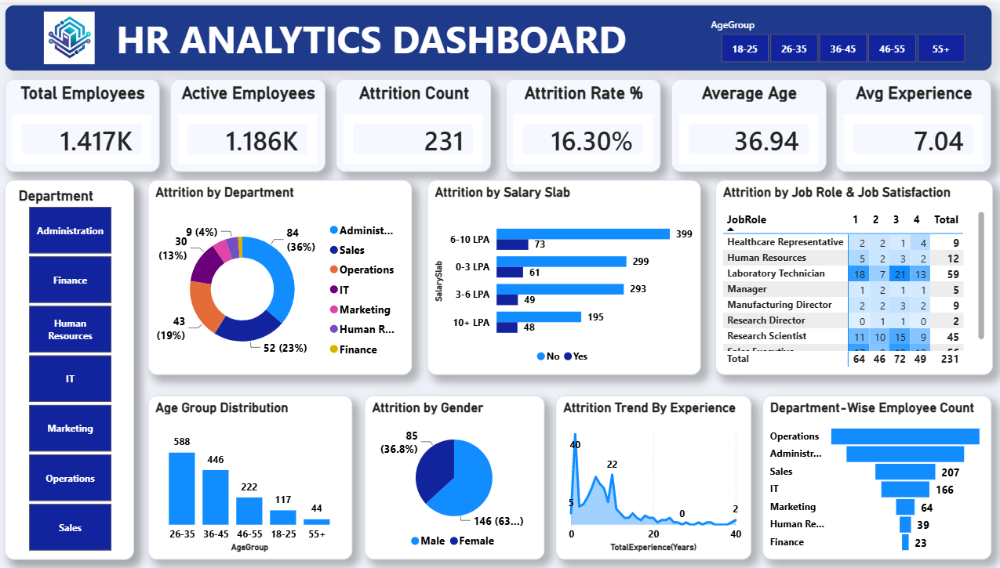

# HR Analytics Power BI Dashboard

## Project Overview

An interactive Power BI dashboard developed to analyze employee data and provide meaningful insights into workforce structure, employee activity, and attrition.

The dashboard helps explore key HR metrics such as total employees, active employees, attrition, attrition rate, average age, and average experience through interactive visualizations and filters.

---

## Project Objectives

- Analyze overall employee workforce data.
- Understand employee attrition patterns.
- Calculate and monitor key HR performance indicators.
- Analyze employee demographics and experience.
- Compare employee statistics across departments.
- Identify patterns in employee attrition.
- Build an interactive and professional HR analytics dashboard.
- Present HR data in a clear and easy-to-understand format.

---

## Dashboard Overview

The HR Analytics dashboard provides an interactive view of employee data using KPIs, charts, filters, and visualizations.

Users can explore the data using the available **Age Group** and **Department** filters.

### Key KPIs

- Total Employees: **1.417K**
- Active Employees: **1.186K**
- Attrition Count: **231**
- Attrition Rate: **16.30%**
- Average Age: **36.94**
- Average Experience: **7.04 Years**

---

## Dashboard Features

### Workforce Analysis

- Total employee count
- Active employee count
- Employee demographic analysis
- Average age
- Average experience
- Department-wise employee analysis

### Attrition Analysis

- Attrition count
- Attrition rate
- Employee attrition patterns
- Department-wise attrition analysis
- Interactive filtering for detailed analysis

### Employee Demographics

- Age group analysis
- Department analysis
- Employee distribution
- Workforce composition

### Interactive Analysis

- Age Group selector
- Department filter
- Interactive charts
- KPI cards
- Dynamic Power BI visuals

---

## Key Insights

The dashboard is designed to help users understand:

- Overall workforce size and active employee strength.
- Employee attrition levels and attrition rate.
- Workforce distribution across departments.
- Employee age-group distribution.
- Average employee age and experience.
- Department-level workforce and attrition patterns.
- Key HR metrics through interactive filtering.

---

## Tools & Technologies

- Microsoft Power BI
- Power Query
- DAX
- Microsoft Excel
- Data Cleaning
- Data Transformation
- Data Modeling
- Data Visualization

---

## Data Preparation

The data preparation process included:

1. Importing the HR dataset into Power BI.
2. Cleaning and transforming the data using Power Query.
3. Preparing the data for HR analysis.
4. Creating calculated measures using DAX.
5. Building relationships and data models where required.
6. Creating KPI cards and interactive visualizations.
7. Adding Age Group and Department filters.
8. Designing the final HR Analytics dashboard.

---

## Dataset

The project uses an HR Analytics dataset containing employee-related information.

The dataset includes information used to analyze:

- Employees
- Employee activity
- Attrition
- Age
- Experience
- Departments
- Workforce characteristics

The dataset used for the project is included in the repository as:

`HR_Analytics_Dataset.xlsx`

---

## Dashboard Preview



---

## Project Files

| File | Description |
|------|-------------|
| `HR_Analytics_Dashboard.pbix` | Power BI dashboard and data model |
| `HR_Analytics_Dashboard.png` | Dashboard preview image |
| `HR_Analytics_Dataset.xlsx` | Dataset used for the analysis |
| `README.md` | Project documentation |

---

## Project Structure

```text
HR-Analytics-PowerBI/
│
├── HR_Analytics_Dashboard.pbix
├── HR_Analytics_Dashboard.png
├── HR_Analytics_Dataset.csv
└── README.md
```

---

## Power BI Skills Demonstrated

This project demonstrates practical knowledge of:

- Power BI Dashboard Development
- Power Query
- Data Cleaning
- Data Transformation
- Data Modeling
- DAX Measures
- KPI Development
- Interactive Filters
- Data Visualization
- Dashboard Design
- HR Analytics
- Business-oriented Data Analysis
- Data Storytelling

---

## Business Questions Addressed

The dashboard helps answer questions such as:

1. How many employees are in the organization?
2. How many employees are currently active?
3. How many employees have left the organization?
4. What is the overall attrition rate?
5. What is the average age of employees?
6. What is the average employee experience?
7. How are employees distributed across departments?
8. How does attrition vary across departments?
9. How are employees distributed across different age groups?
10. What HR patterns can be identified from the employee data?
11. How do HR metrics change when different departments are selected?
12. How can interactive Power BI filters be used for HR analysis?

---

## Project Outcome

The project converts employee data into an interactive HR Analytics dashboard.

It provides a centralized view of workforce size, active employees, attrition, employee demographics, departments, age groups, and experience.

The dashboard allows users to interact with HR data through dynamic filters and visualizations, making it easier to explore workforce and attrition-related information.

---

## Conclusion

The HR Analytics Power BI Dashboard demonstrates how employee data can be transformed into meaningful HR insights using Power Query, DAX, data modeling, and interactive Power BI visualizations.

The project provides a clear view of workforce structure, employee activity, attrition, demographics, departments, and experience.

This project helped strengthen practical skills in data cleaning, data transformation, DAX, data visualization, dashboard development, and business intelligence.
