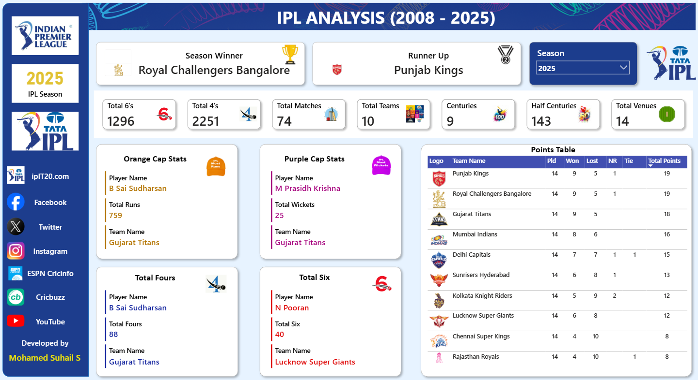

# IPL Analysis Power BI Dashboard

## Project Overview

An interactive Power BI dashboard developed to analyze Indian Premier League (IPL) data from 2008 to 2025 and generate meaningful insights into team performance, player performance, scoring patterns, and tournament statistics.

The dashboard provides a season-wise view of IPL performance using interactive filters, KPIs, charts, and player statistics.

---

## Project Objectives

- Analyze IPL performance across different seasons.
- Compare team performance and tournament outcomes.
- Analyze batting and bowling performance.
- Identify important player performance statistics.
- Analyze scoring patterns across IPL seasons.
- Track batting milestones such as fours, sixes, centuries, and half-centuries.
- Present tournament statistics through interactive visualizations.
- Build a professional and easy-to-understand Power BI dashboard.

---

## Dashboard Overview

The dashboard provides an interactive season-wise analysis of IPL data.

Users can select a particular season and explore the corresponding tournament statistics, team performance, and player performance.

### Key KPIs

- Season Winner
- Runner Up
- Total Matches
- Total Teams
- Total Venues
- Total Fours
- Total Sixes
- Centuries
- Half Centuries

---

## Dashboard Features

### Season Analysis

- Interactive season selector
- Season-wise tournament statistics
- Winner and runner-up information
- Total matches played
- Number of teams
- Number of venues

### Team Performance Analysis

- Season winner
- Runner-up
- Team participation
- Team performance comparison
- Tournament-level team statistics

### Player Performance Analysis

- Orange Cap statistics
- Purple Cap statistics
- Top batting performance
- Top bowling performance
- Centuries
- Half-centuries

### Scoring Analysis

- Total fours
- Total sixes
- Centuries
- Half-centuries
- Season-wise scoring statistics

### Tournament Statistics

- Total matches
- Total teams
- Total venues
- Season-wise tournament performance
- Overall IPL statistics

---

## Key Insights

The dashboard is designed to help users explore and understand:

- How IPL tournament statistics changed across seasons.
- How team participation varied over the years.
- How batting and bowling performances changed across seasons.
- The contribution of top-performing players.
- Changes in boundary-scoring patterns.
- Distribution of centuries and half-centuries across seasons.
- Overall tournament trends from 2008 to 2025.

---

## Tools & Technologies

- Microsoft Power BI
- Power Query
- DAX
- Microsoft Excel
- Data Cleaning
- Data Transformation
- Data Modeling
- Data Visualization

---

## Data Preparation

The data preparation process included:

1. Importing IPL datasets into Power BI.
2. Cleaning and transforming the data using Power Query.
3. Preparing tables for analysis.
4. Creating relationships between relevant tables.
5. Creating calculated measures using DAX.
6. Building KPIs and visualizations.
7. Adding interactive filters and season selection.
8. Designing the final dashboard.

---

## Dataset

The project uses IPL data covering the period from 2008 to 2025.

The dataset contains information related to:

- IPL matches
- Teams
- Players
- Match statistics
- Batting statistics
- Bowling statistics
- Tournament information

The complete dataset is included in the repository as:

`IPL_Dataset.zip`

---

## Dashboard Preview



---

## Project Files

| File | Description |
|------|-------------|
| `IPL_Analysis_Dashboard.pbix` | Power BI dashboard and data model |
| `IPL_Analysis_Dashboard.png` | Dashboard preview image |
| `IPL_Dataset.zip` | Dataset used for the analysis |
| `README.md` | Project documentation |

---

## Project Structure

```text
IPL-Analysis-PowerBI/
│
├── IPL_Analysis_Dashboard.pbix
├── IPL_Analysis_Dashboard.png
├── IPL_Dataset.zip
└── README.md

## Conclusion

The IPL Analysis Power BI Dashboard provides an interactive and comprehensive view of IPL tournament data from 2008 to 2025.

The project demonstrates how raw IPL data can be transformed into meaningful insights using Power Query, DAX, data modeling, and interactive Power BI visualizations.

The dashboard enables users to explore season-wise tournament statistics, team performance, player performance, and scoring trends through an easy-to-understand interface.

This project helped strengthen practical skills in data cleaning, analysis, visualization, dashboard development, and business intelligence.
