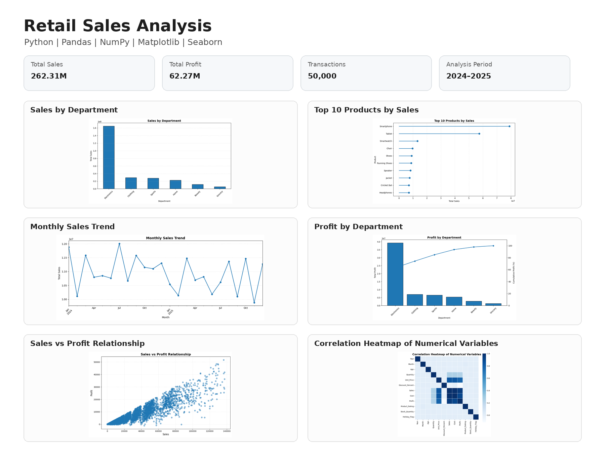

# Retail Sales Analysis using Python

## Project Overview

This project analyzes retail sales data to understand sales performance, profitability, customer behavior, product performance, and regional sales patterns.

The analysis is performed using Python and popular data analytics libraries such as Pandas, NumPy, Matplotlib, and Seaborn.

The project focuses on transforming raw retail transaction data into meaningful business insights through data cleaning, exploratory data analysis, statistical analysis, and data visualization.

---

## Project Objectives

- Analyze overall sales and profit performance.
- Identify high-performing products and categories.
- Understand customer purchasing behavior.
- Compare sales and profitability across different regions and cities.
- Analyze sales performance across store types.
- Identify important trends in sales and transactions.
- Analyze the relationship between sales, cost, and profit.
- Understand the impact of discounts on sales and profitability.
- Analyze customer demographics and purchasing patterns.
- Generate actionable business insights and recommendations.

---

## Dataset

The project uses a retail transaction dataset containing detailed sales information.

The dataset includes transaction-level information related to stores, customers, products, sales, costs, discounts, profit, and payment methods.

### Dataset Features

| Column | Description |
|--------|-------------|
| `Store_ID` | Unique identifier of the store |
| `Store_Type` | Type of retail store |
| `Date` | Transaction date |
| `City` | City where the transaction occurred |
| `Customer_ID` | Unique customer identifier |
| `Gender` | Customer gender |
| `Age` | Customer age |
| `Category` | Product category |
| `Product` | Product name |
| `Quantity` | Quantity purchased |
| `Unit_Price` | Price per unit |
| `Discount_Percent` | Discount percentage applied |
| `Sales` | Total sales value |
| `Cost` | Cost associated with the transaction |
| `Profit` | Profit generated from the transaction |
| `Payment_Method` | Payment method used by the customer |

The dataset covers retail transactions across multiple cities and store types over 2024–2025.

---

## Tools & Technologies

- Python
- Pandas
- NumPy
- Matplotlib
- Seaborn
- Jupyter Notebook

---

## Data Analysis Process

The project follows a structured data analysis workflow:

1. Load the retail sales dataset.
2. Understand the dataset structure.
3. Perform data cleaning and preprocessing.
4. Check missing values and data types.
5. Perform descriptive and statistical analysis.
6. Analyze sales and profit performance.
7. Analyze product and category performance.
8. Analyze customer behavior.
9. Compare regional and city-level performance.
10. Analyze store type performance.
11. Study relationships between numerical variables.
12. Create meaningful visualizations.
13. Generate business insights and recommendations.

---

## Exploratory Data Analysis

The analysis covers multiple areas of retail performance.

### Sales Performance

- Overall sales analysis
- Sales by category
- Sales by product
- Sales by city
- Sales by store type
- Sales trends over time

### Profitability Analysis

- Overall profit performance
- Profit by category
- Profit by product
- Profit by city
- Profit compared with sales and cost
- Identification of high-profit areas

### Product Analysis

- Product-wise sales performance
- High-performing products
- Product contribution to overall sales
- Quantity sold by product
- Product profitability

### Customer Analysis

- Customer purchasing patterns
- Customer distribution by age
- Gender-wise purchasing behavior
- Customer-level sales analysis
- Relationship between customer demographics and purchasing behavior

### Regional Analysis

- City-wise sales performance
- City-wise profitability
- Comparison of regional performance
- Identification of strong and weak performing locations

### Discount Analysis

- Discount percentage analysis
- Relationship between discounts and sales
- Relationship between discounts and profit
- Understanding the effect of discounting on profitability

### Payment Method Analysis

- Distribution of payment methods
- Sales by payment method
- Customer transaction behavior by payment method

---

## Data Visualization

The project uses Python visualization libraries to communicate analytical findings clearly.

Visualizations include:

- Bar charts
- Distribution plots
- Scatter plots
- Category comparisons
- Sales performance charts
- Profit analysis charts
- Customer analysis visualizations
- Relationship analysis between numerical variables

### Sample Visualization



---

## Key Business Questions

The project helps answer questions such as:

1. What is the overall sales performance?
2. What is the overall profit performance?
3. Which categories generate the highest sales?
4. Which products perform strongly?
5. Which products contribute significantly to profit?
6. Which cities generate higher sales?
7. Which cities generate higher profit?
8. Which store types perform better?
9. How does sales performance change over time?
10. How does customer age relate to purchasing behavior?
11. How does gender relate to purchasing patterns?
12. What is the relationship between sales and profit?
13. How does discount percentage affect sales?
14. How does discounting affect profitability?
15. Which payment methods are commonly used?
16. Which areas require improvement based on sales and profitability?

---

## Business Insights

The analysis is designed to identify:

- Important sales and profit patterns.
- High-performing product categories.
- Strong-performing products.
- Differences in performance across cities.
- Differences between store types.
- Customer purchasing patterns.
- The relationship between sales, cost, and profit.
- The effect of discounts on business performance.
- Opportunities for improving sales and profitability.

---

## Business Recommendations

Based on the analysis, businesses can use the findings to:

- Focus on high-performing products and categories.
- Improve strategies for lower-performing products.
- Optimize inventory based on product demand.
- Review pricing and discount strategies.
- Focus marketing activities on strong-performing regions.
- Improve performance in lower-performing locations.
- Understand customer purchasing patterns for targeted marketing.
- Use profitability analysis to support pricing and promotional decisions.

---

## Python Skills Demonstrated

This project demonstrates practical knowledge of:

- Python for Data Analysis
- Pandas
- NumPy
- Data Cleaning
- Data Preprocessing
- Exploratory Data Analysis
- Statistical Analysis
- Matplotlib
- Seaborn
- Data Visualization
- Correlation Analysis
- Business Insight Generation
- Data Storytelling

---

## Project Files

| File | Description |
|------|-------------|
| `Retail_Sales_Analysis.ipynb` | Jupyter Notebook containing the complete Python analysis |
| `Retail_Sales_Analysis.png` | Project analysis preview image |
| `Retail_Sales_Dataset.csv` | Retail sales dataset used for the analysis |
| `README.md` | Project documentation |

---

## Project Structure

```text
Retail-Sales-Analysis-Python/
│
├── Retail_Sales_Analysis.ipynb
├── Retail_Sales_Analysis.png
├── Retail_Sales_Dataset.csv
└── README.md
